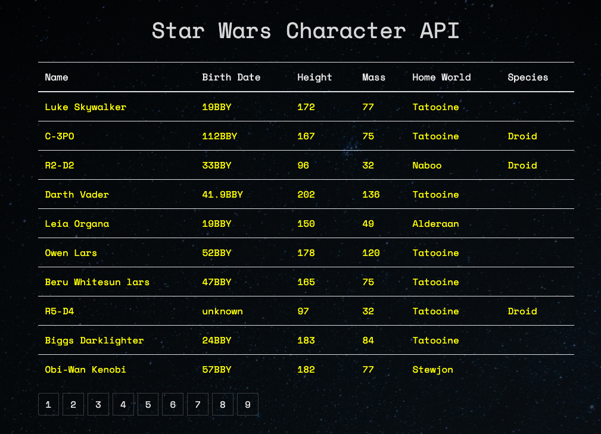

# Star Wars Character API

App built with React and bootstrap that using axios to pull data from the swapi.co Star Wars Character API.  

## Summary

The Star Wars Character api was motivated by my desire to learn more about how an api works and how to "pull" the data from one to use it with React's virtual DOM. 

There's an initial api call when the app component mounts and it loads data from swapi.co which is rendered in a table with the name, birth date, heigh, mass, home world and species of each character throughout the Star Wars movie and story catalog. After the 1st api call which is made through axios, the api data loads based on paginated results that swapi.co has limited to 10 results per "page". Click one of the pagination sqaures and it makes an api get request to the relevant page number and it loads the results for the next 10 characters.  



See my deployed version on Heroku - [SW Charater API](https://reid-star-wars.herokuapp.com/)

## Local Installation Directions

First install the project dependencies and scripts.  In the root directory run the command:

```
npm i
```

Then to run the app on your system use the command:

```
npm run start
```

## Tech Stack Used
    * React.js
    * Axios
    * SWAPI API
    * Bootstrap/React-Bootstrap

## Author 

* **Reid Muchow** - *Front-End Software Developer* - [Website](https://www.reidmuchow.com) | [LinkedIn](https://www.linkedin.com/in/reidmuchow/)