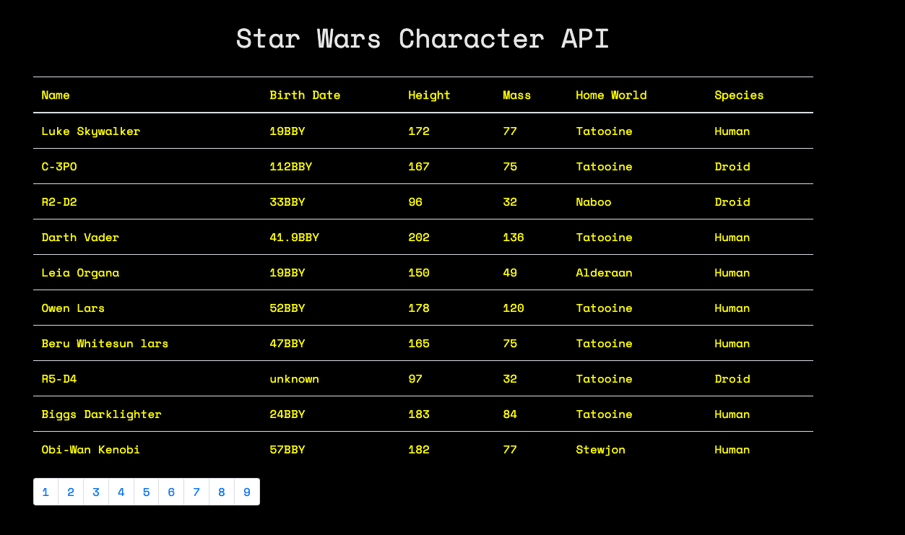

# Star Wars Character API (React)

App built with React and bootstrap that using axios to pull data from the swapi.co Star Wars Character API.  See my deployed version on Heroku - [HERE](https://reid-star-wars.herokuapp.com/) or open-source here at my remote repostiory [Github](https://github.com/ram071985/star-wars-api)

## Summary

The Star Wars Character api app I created was motivated by my desire to learn more about how an api works and how to "pull" the data from one to use it with React's virtual DOM.  There's an initial api call when the app component mounts and it loads data from swapi.co which is rendered in a table with the name, birth date, heigh, mass, home world and species of each character throughout the Star Wars movie and story catalog.  After the 1st api call which is made through axios, the api data loads based on paginated results that swapi.co has limited to 10 results per "page".  You click one of the pagination sqaures and it makes an api get request to the relevant page number and it loads the results for the next 10 characters.  I was able to become very comfortable with React framework tools such as async/await for asynchronous programming and with axios to perform my api calls.

## Local Installation Directions

- run npm i in root directory to install scripts
- run npm run start to load app

## Features

- Displays data about your favortie Star Wars characters including name, birth date, height, mass, home world and species.
- Loading notification while awating api response
- Api results paginated for a more organized and uniform viewing experience
- Built with the popular javascript framework React
- Mobile-First design practices

## Author 

* **Reid Muchow** - *Front-End Software Developer* - [Website](https://www.reidmuchow.com) | [LinkedIn](https://www.linkedin.com/in/reidmuchow/)